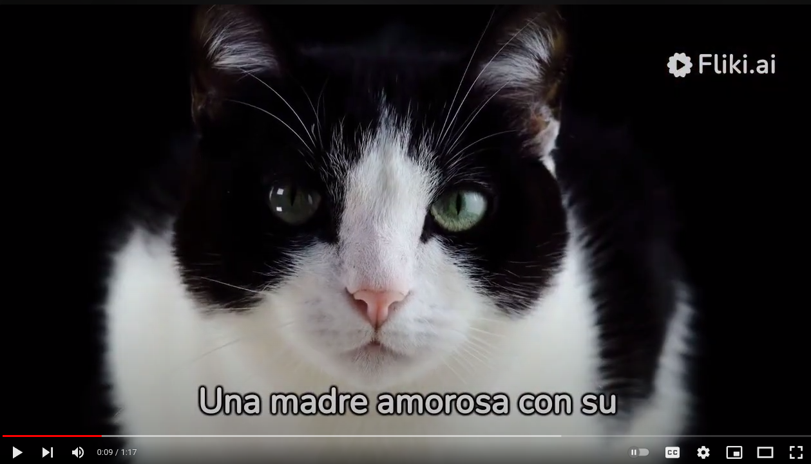
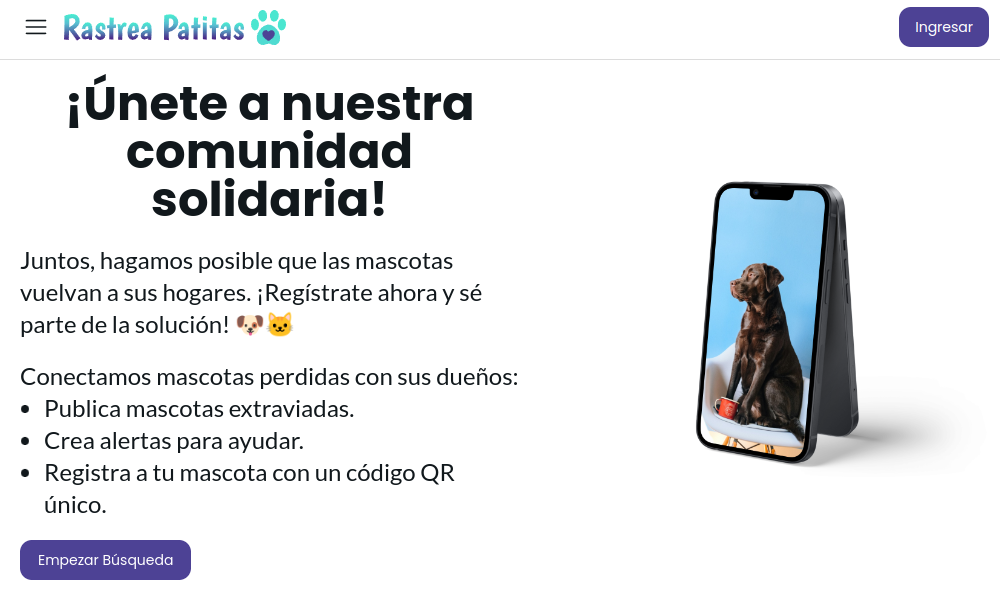
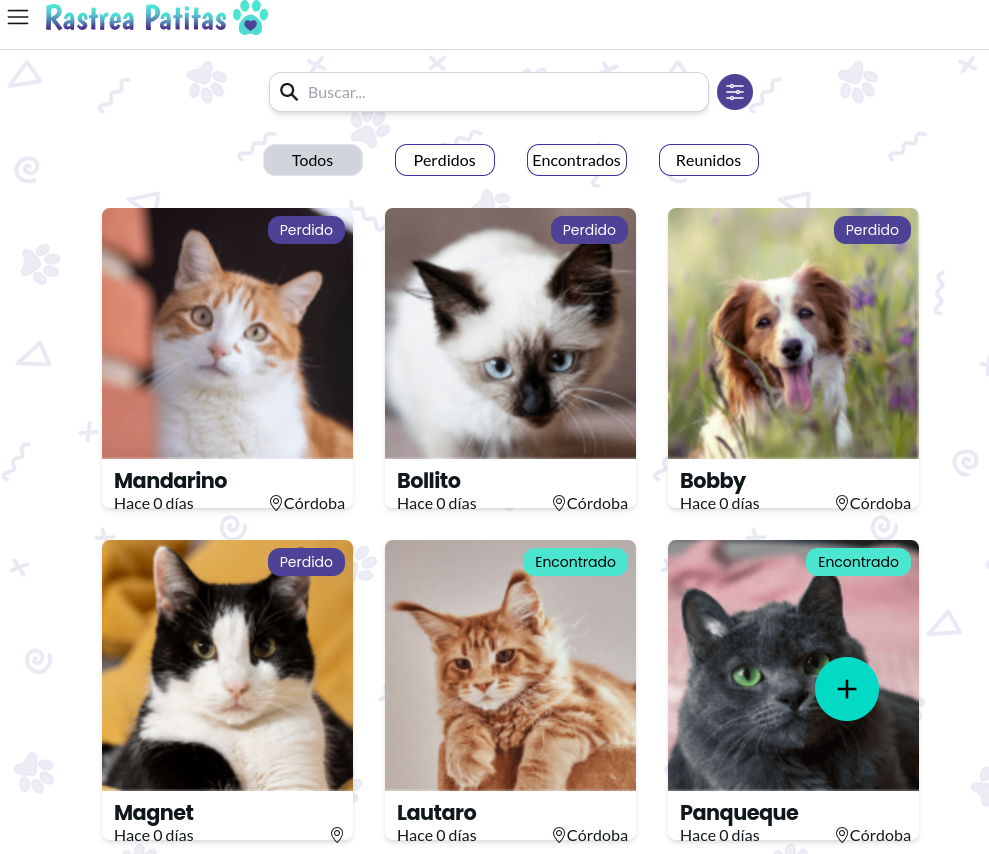
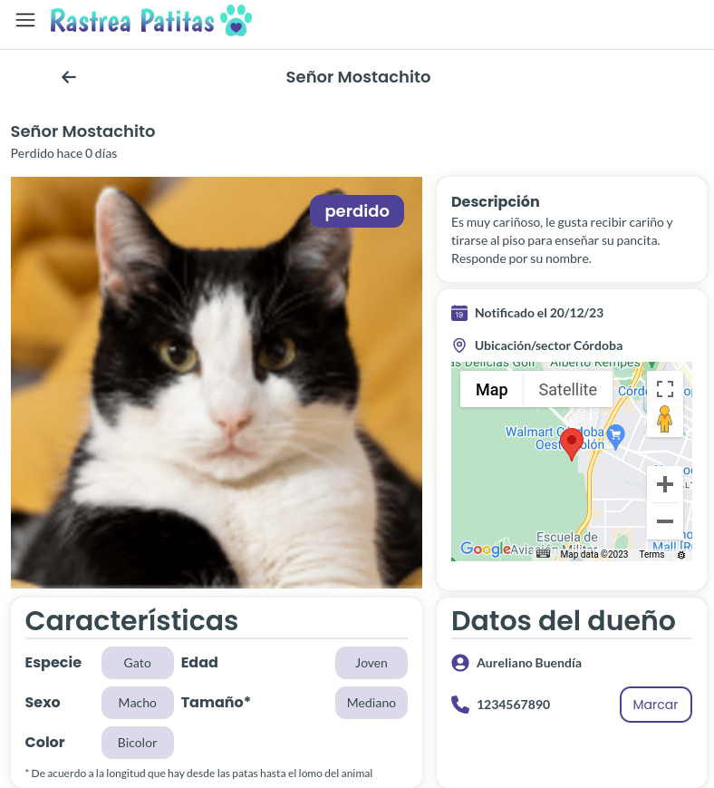
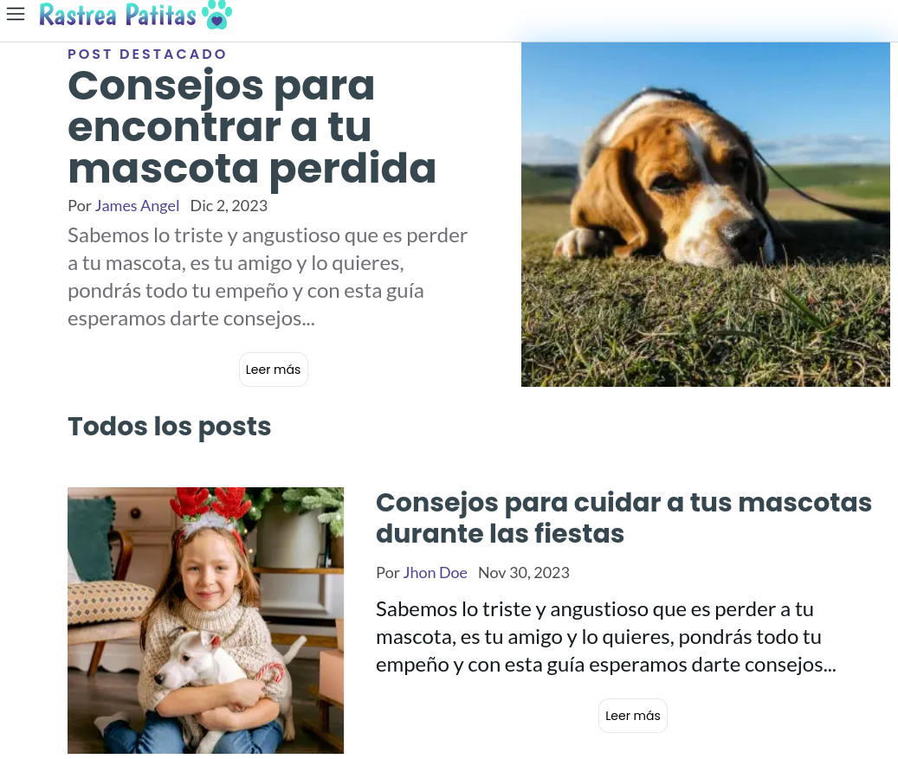
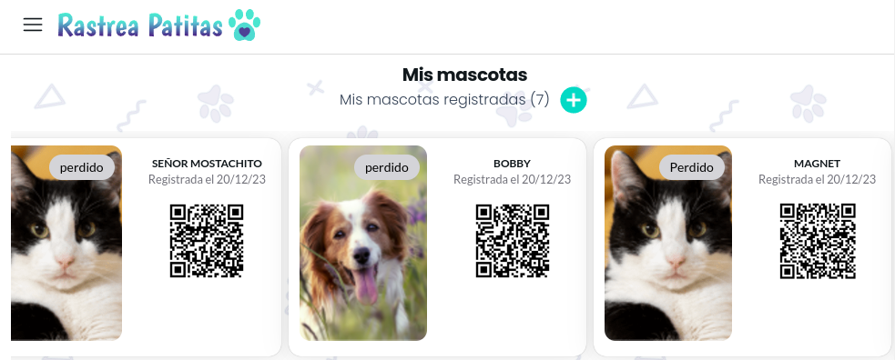
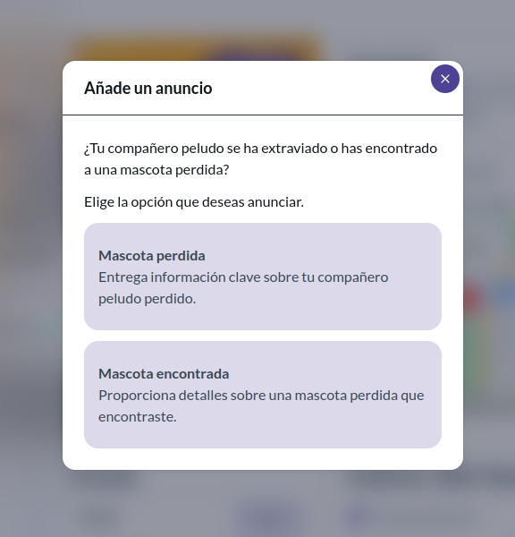
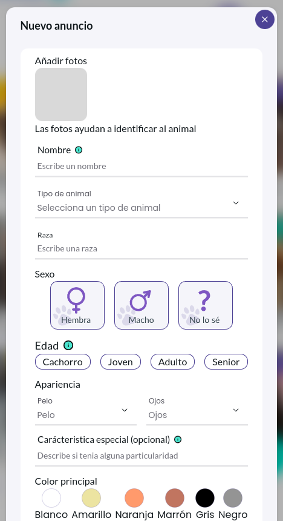
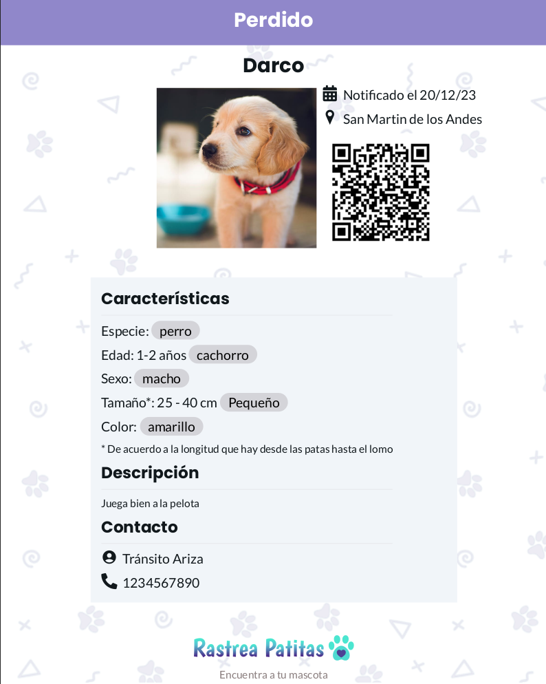

# Rastrea Patitas

<!-- add image by url -->
<br />

<div align="center">


<br />
<div align="center">

  

<h3 align="center">Rastrea Patitas</h3>

  <p align=center">
   Rastrea Patitas es una aplicación de búsqueda de mascotas que facilita a los usuarios el registro detallado de sus mascotas perdidas, fomenta la colaboración en la comunidad para la búsqueda y reunión de mascotas, y proporciona notificaciones instantáneas sobre coincidencias potenciales.
    <br />
    <br />
    <a href="https://www.youtube.com/watch?v=XIhyPCSCQW8" target="_blank">Ver Video Promocional</a>
    ·
    <a href="https://github.com/No-Country/c14-46-m-csharp-react/issues" target="_blank">Reportar Bug</a>
  </p>
</div>

<br>
<br>
<hr>
<h1 align="center"> 
Acerca del Proyecto
</h1>


<p align='left'>La web ofrecerá un entorno fácil de usar donde los usuarios puedan:</p>

<p align='left'>1. Registrar Mascotas: Proporcionar información detallada sobre sus mascotas, incluyendo fotos, para crear perfiles completos.</p>
<p align='left'>2. Búsqueda Eficiente: Facilitar la búsqueda de mascotas perdidas mediante filtros como especie, ubicación(geolocalización o manual), raza y color.</p>
<p align='left'>3. Gestión de Usuarios: Ofrecer funciones seguras de registro, inicio de sesión y gestión de perfiles para garantizar la autenticidad de la información.</p>
<p align='left'>4. Código QR para Identificación: Generar códigos QR únicos para las mascotas, permitiendo a los usuarios escanearlos para acceder a información detallada.</p>
<p align='left'>5. Notificaciones Instantáneas: Enviar notificaciones a los usuarios cuando haya coincidencias potenciales entre mascotas perdidas y encontradas.</p>


<br>
<br>
<hr>
<h1 align="center"> 
Tecnologias Utilizadas
</h1>


<br>
<br>
<hr>
<h1 align="center"> 
Herramientas para la Organización de Tareas
</h1>

<a href="https://trello.com/b/Q0G3my8O/sb-klinika" target="_blank">
  
</a>

<a href="https://www.nocountry.tech/" target="_blank">
  
</a>

<a href="https://discord.gg/Zj2GmPwg" target="_blank">
  
</a>


<br>
<br>
<hr>
<h1 align="center"> 
Instrucciones para ejecutar la app
</h1>

Instrucciones para clonar el repo y ejecutar el proyecto localmente: 

1- Clonar este repositorio
   ```sh
   git clone https://github.com/No-Country/s12-03-m-node-react.git
   ```

2- Abrir la terminal y correr el comando:
  ```sh
  cd front/rastrea-patitas/
  ```
3- Finalmente ejecutar los comandos:
  ```sh
  npm install
  npm run dev
  ```

O simplemente clickea en el link de 
<a href="https://rastreapatitas.vercel.app/" target="_blank">Visitar App</a>

<br>
<br>
<hr>
<h1 align="center"> 
Guía Básica de uso
</h1>

<p align='left'>Desde el onboarding un usuario visitante puede tener una visión general de las características de la app, y incluso sin estar logueado, puede acceder a las últimas alertas de mascotas haciendo clic en el botón Empezar Búsqueda.</p> 
<p align='left'>Desde el menú hamburguesa es posible, además, acceder al blog libremente. Desde el menú se selecciona la opción de login o registro, según corresponda. Para crear un nuevo anuncio, es un requisito un usuario registrado y logueado.</p> 
<p align='left'>Una vez logueado en la app, la app redirige a la sección Mis Mascotas con tarjetas de las mascotas registradas y la separación en las secciones Mascotas Perdidas, Mascotas Encontradas, Mascotas Reunidas. Al hacer clic en una card, se despliega la misma mostrando toda la información relacionada a la mascota. Siempre desde el menú, es posible crear un nuevo anuncio, o desde la vista home haciendo clic en el botón + (crear) desde home. Al seleccionar la opción de crear el alerta, tenemos un formulario para agregar fotos y completar campos con información detallada de la mascota.</p> 
<p align='left'>Una vez completado el formulario y hacer la publicación, la app nos redirige a la pantalla con el detalle de la misma y donde tenemos la posibilidad de descargar un afiche en formato .pdf.</p> 
<p align='left'>En caso de que el usuario se desloguee, los datos se resetean y la app redirije al formulario de login.</p> 

<br>
<br>

<hr>
<h1 align="center"> 
Equipo
</h1>

<table>
<tr>
    <td>
      <div align="center">
        <a href="https://www.linkedin.com/in/ireneporro16/" target="_blank" rel="author">
          
        </a>
        <a href="" target="_blank" rel="author">
          <h4 style="margin-top: 1rem;">Irene Porro</h4>
          <h4 style="margin-top: 1rem;">UX/UI</h4>
        </a>
        <a href="https://www.linkedin.com/in/ireneporro16/" target="_blank">
          
        </a>
      </div>
    </td>
    <td>
      <div align="center">
        <a href="https://www.linkedin.com/in/macadiazcon/" target="_blank" rel="author">
          
        </a>
        <a href="" target="_blank" rel="author">
          <h4 style="margin-top: 1rem;">Maca Diaz</h4>
          <h4 style="margin-top: 1rem;">UX/UI</h4>
        </a>
        <a href="https://www.linkedin.com/in/macadiazcon/" target="_blank">
          
        </a>
      </div>
    </td>
    <td>
      <div align="center">
        <a href="https://www.linkedin.com/in/melanie-calderon-977ab729a/" target="_blank" rel="author">
          
        </a>
        <a href="" target="_blank" rel="author">
          <h4 style="margin-top: 1rem;">Melanie Calderón</h4>
          <h4 style="margin-top: 1rem;">UX/UI</h4>
        </a>
        <a href="https://www.linkedin.com/in/melanie-calderon-977ab729a/" target="_blank">
          
        </a>
      </div>
    </td>
    <td>
      <div align="center">
        <a href="https://www.linkedin.com/in/james-angelb/" target="_blank" rel="author">
          
        </a>
        <a href="" target="_blank" rel="author">
          <h4 style="margin-top: 1rem;">James Angel</h4>
          <h4 style="margin-top: 1rem;">UX/UI</h4>
        </a>
        <a href="https://www.linkedin.com/in/james-angelb/" target="_blank">
          
        </a>
      </div>
    </td>
    </tr>
  <tr>
    <td>
      <div align="center">
        <a href="https://www.linkedin.com/in/juan-nebbia/" target="_blank" rel="author">
          
        </a>
        <a href="https://github.com//JuanNebbia" target="_blank" rel="author">
          <h4 style="margin-top: 1rem;">Juan Nebbia</h4>
          <h4 style="margin-top: 1rem;">Back-end Developer</h4>
        </a>
        <a href="https://github.com//JuanNebbia" target="_blank">
          
        </a>
        <a href="https://www.linkedin.com/in/juan-nebbia/" target="_blank">
          
        </a>
      </div>
    </td>
    <td>
      <div align="center">
        <a href="https://www.linkedin.com/in/kevindefalco/" target="_blank" rel="author">
          
        </a>
        <a href="https://github.com/kevod1997" target="_blank" rel="author">
          <h4 style="margin-top: 1rem;">Kevin Defalco</h4>
          <h4 style="margin-top: 1rem;">Back-end Developer</h4>
        </a>
        <a href="https://github.com/kevod1997" target="_blank">
          
        </a>
        <a href="https://www.linkedin.com/in/kevindefalco/" target="_blank">
          
        </a>
      </div>
    </td>
    <td>
      <div align="center">
        <a href="https://www.linkedin.com/in/josé-maría-pérez-b1b059236/" target="_blank" rel="author">
          
        </a>
        <a href="https://github.com/Jope2022" target="_blank" rel="author">
          <h4 style="margin-top: 1rem;">José María Perez</h4>
          <h4 style="margin-top: 1rem;">Back-end Developer</h4>
        </a>
        <a href="https://github.com/Jope2022" target="_blank">
          
        </a>
        <a href="https://www.linkedin.com/in/josé-maría-pérez-b1b059236/" target="_blank">
          
        </a>
      </div>
    </td>
    <td>
      <div align="center">
        <a href="https://www.linkedin.com/in/tomas-cerdeyra-007b01234/" target="_blank" rel="author">
          
        </a>
        <a href="https://github.com/TomasCerdeyra" target="_blank" rel="author">
          <h4 style="margin-top: 1rem;">Tomás Cerdeyra</h4>
          <h4 style="margin-top: 1rem;">Back-end Developer</h4>
        </a>
        <a href="https://github.com/TomasCerdeyra" target="_blank">
          
        </a>
        <a href="https://www.linkedin.com/in/tomas-cerdeyra-007b01234/" target="_blank">
          
        </a>
      </div>
    </td>
    </tr>
    <tr>
    <td>
      <div align="center">
        <a href="https://www.linkedin.com/in/emiliopino/" target="_blank" rel="author">
          
        </a>
        <a href="https://github.com/pinoen" target="_blank" rel="author">
          <h4 style="margin-top: 1rem;">Emilio Pino</h4>
          <h4 style="margin-top: 1rem;">Front-end Developer</h4>
        </a>
        <a href="https://github.com/pinoen" target="_blank">
          
        </a>
        <a href="https://www.linkedin.com/in/emiliopino/" target="_blank">
          
        </a>
      </div>
    </td>
    <td>
      <div align="center">
        <a href="https://ar.linkedin.com/in/valentino-indorato" target="_blank" rel="author">
          
        </a>
        <a href="https://github.com/ValentinoIndorato" target="_blank" rel="author">
          <h4 style="margin-top: 1rem;">Valentino Indorato</h4>
          <h4 style="margin-top: 1rem;">Front-end Developer</h4>
        </a>
        <a href="https://github.com/ValentinoIndorato" target="_blank">
          
        </a>
        <a href="https://ar.linkedin.com/in/valentino-indorato" target="_blank">
          
        </a>
      </div>
    </td>
    <td>
      <div align="center">
        <a href="https://www.linkedin.com/in/dalianaguirre/" target="_blank" rel="author">
          
        </a>
        <a href="https://github.com/Dalianaguirre" target="_blank" rel="author">
          <h4 style="margin-top: 1rem;">Dalian Aguirre</h4>
          <h4 style="margin-top: 1rem;">Front-end Developer</h4>
        </a>
        <a href="https://github.com/Dalianaguirre" target="_blank">
          
        </a>
        <a href="https://www.linkedin.com/in/dalianaguirre/" target="_blank">
          
        </a>
      </div>
    </td>
    <td>
      <div align="center">
        <a href="https://www.linkedin.com/in/HernanNicolasVarela/" target="_blank" rel="author">
          
        </a>
        <a href="https://github.com/hernan-varela/hernan-varela" target="_blank" rel="author">
          <h4 style="margin-top: 1rem;">Hernán Varela</h4>
          <h4 style="margin-top: 1rem;">Front-end Developer</h4>
        </a>
        <a href="https://github.com/hernan-varela/hernan-varela" target="_blank">
          
        </a>
        <a href="https://www.linkedin.com/in/HernanNicolasVarela/" target="_blank">
          
        </a>
      </div>
    </td>
    <td>
      <div align="center">
        <a href="https://www.linkedin.com/in/ricardoagustingonzalez/" target="_blank" rel="author">
          
        </a>
        <a href="https://github.com/AgustinGonzalez1" target="_blank" rel="author">
          <h4 style="margin-top: 1rem;">Agustin Gonzalez</h4>
          <h4 style="margin-top: 1rem;">Front-end Developer</h4>
        </a>
        <a href="https://github.com/AgustinGonzalez1" target="_blank">
          
        </a>
        <a href="https://www.linkedin.com/in/ricardoagustingonzalez/" target="_blank">
          
        </a>
      </div>
    </td>
    </tr>
    <tr>
    <td>
      <div align="center">
        <a href="https://www.linkedin.com/in/mariajosepautassio/" target="_blank" rel="author">
          
        </a>
        <a href="" target="_blank" rel="author">
          <h4 style="margin-top: 1rem;">María José Pautassio</h4>
          <h4 style="margin-top: 1rem;">QA / PM</h4>
        </a>
        <a href="https://www.linkedin.com/in/mariajosepautassio/" target="_blank">
          
        </a>
      </div>
    </td>
  </tr>
</table>

<br>
<hr>
<h1 align="center"> 

<a href="https://www.youtube.com/watch?v=XIhyPCSCQW8" target="_blank" rel="noopener noreferrer">Video</a>
</h1>
<hr>
<br>

<p align="center"><a href="https://www.youtube.com/watch?v=XIhyPCSCQW8" target="_blank" rel="noopener noreferrer"></a></p>

<br>
<br>

<hr>
<h1 align="center"> 
Capturas de Pantalla de las diferentes Páginas
</h1>
<hr>

















<br>
<br>
<hr>
<h1 align="center"> 
Agradecimientos
</h1>
<hr>


[No Country](https://www.nocountry.tech/)